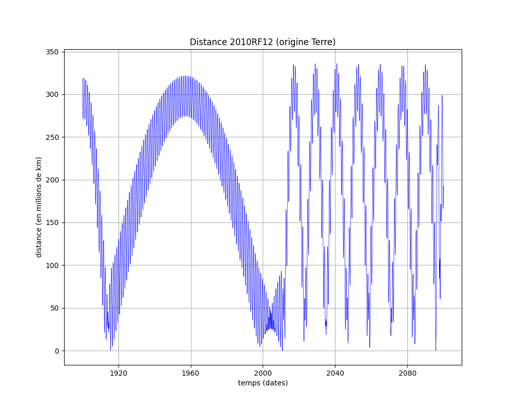
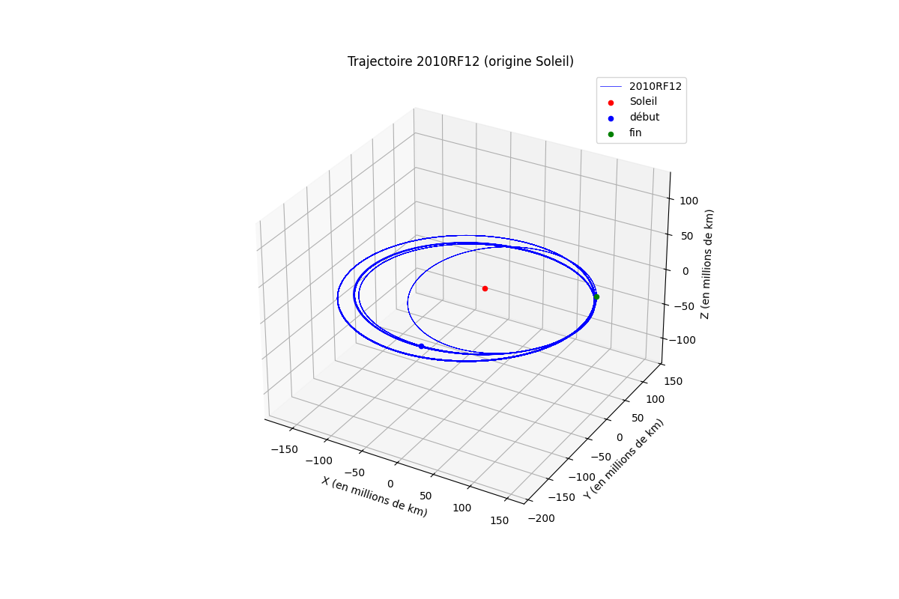
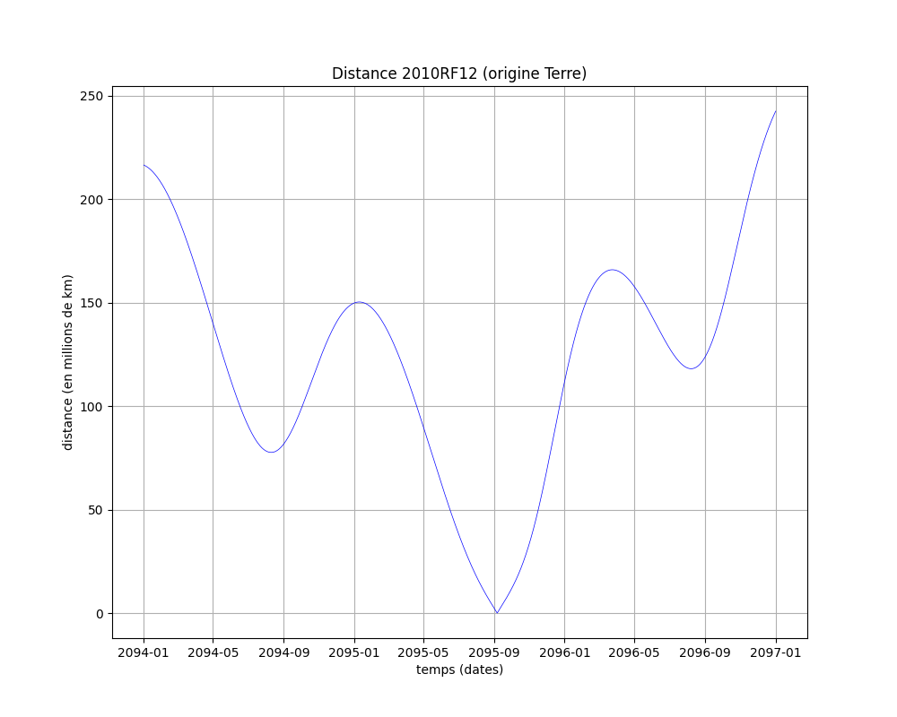
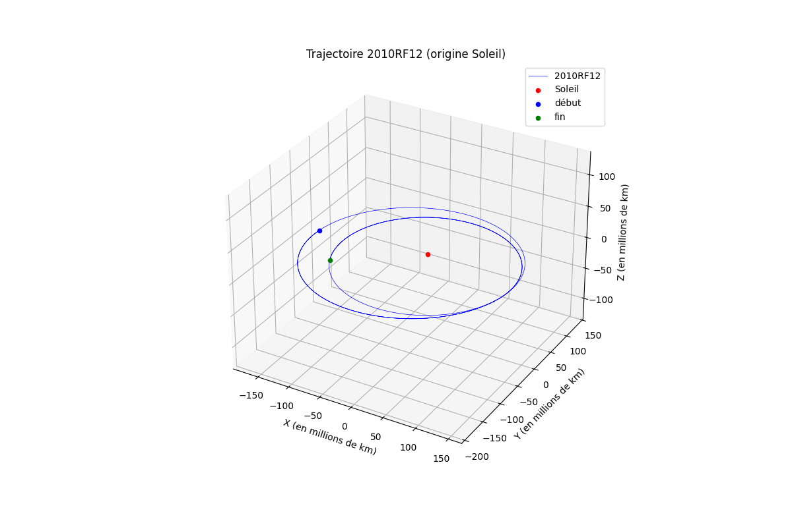
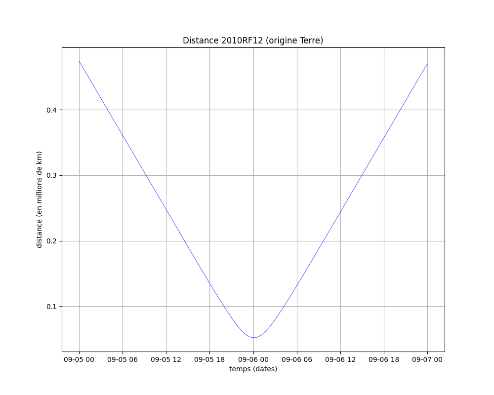
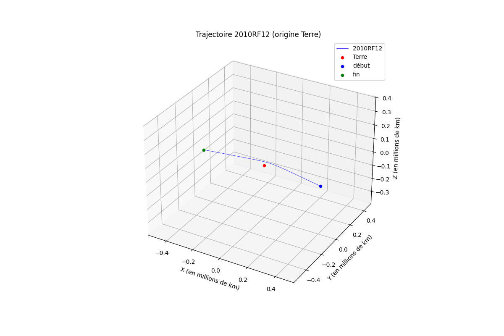

# 2010 RF12 (visualisations et simulations numériques en Python)

## Description

### Introduction

L'astéroïde "2010 RF12" est un "tout petit astéroïde" (1), avec une dimension estimée de 7 mètres, et une masse estimée de 500 tonnes. La probabilité d'impact avec la Terre est estimée à 10% en 2095 (1).

(1) https://en.wikipedia.org/wiki/2010_RF12

L'estimation de sa trajectoire donne accès à plusieurs dates auxquelles il sera au plus proche de la Terre. La rubrique "Close Approach Data" sur le site "Small-Body Database Lookup" (2) du JPL permet d'obtenir ces informations.

(2) https://ssd.jpl.nasa.gov/tools/sbdb_lookup.html#/?sstr=2010%20RF12&view=OPC

Sur ce site, on obtient la table ci-dessous, avec une "distance nominale" classée par ordre croissant.
```
Date/Time (TDB)                 Body           Nominal Distance (km)    Minimum Distance (km)      Maximum Distance (km)
2095-Sep-06 00:06 ±   00:20     Earth          51907                    1554                       236516
2010-Sep-08 21:13 ± < 00:01     Earth          79381                    79380                      79381
2010-Sep-09 13:56 ± < 00:01     Moon           108190                   108189                     108191
1915-Sep-11 04:41 ±   00:25     Moon           354853                   327993                     381715
2095-Sep-06 08:42 ±   16:44     Moon           405909                   25069                      803787
1915-Sep-10 06:13 ±   00:08     Earth          463223                   435921                     490650
2059-Feb-17 12:08 ±   00:07     Earth          3534843                  3528821                    3540865
1998-Apr-01 01:04 ±   00:01     Earth          4050362                  4050333                    4050390
2009-Sep-09 08:42 ± < 00:01     Earth          4083600                  4082398                    4084803
1916-Sep-08 04:52 ±   00:48     Earth          5042106                  4905899                    5178312
```
La visualisation des trajectoires sur différentes périodes de temps, et leur simulation, montrent la difficulté de prédire ces trajectoires à long terme et le changement notable de trajectoire après chaque passage à proximité de la Terre.

### Etapes suivies

On génère le fichier avec la liste des astres qui nous concerneront.
```python
planetes(Planetes='Planetes.csv',Ligne = '2010RF12,0,km^3 s^-2,2010 RF12')
```

Ce fichier a le contenu visualisé ci-dessous.
```python
         Nom            mu      units         id
0     Soleil  1.327124e+11  km^3 s^-2         10
1    Mercure  2.203187e+04  km^3 s^-2          1
2      Venus  3.248586e+05  km^3 s^-2          2
3      Terre  3.986004e+05  km^3 s^-2        399
4       Lune  4.902800e+03  km^3 s^-2        301
5       Mars  4.282838e+04  km^3 s^-2          4
6    Jupiter  1.267128e+08  km^3 s^-2          5
7    Saturne  3.794058e+07  km^3 s^-2          6
8     Uranus  5.794556e+06  km^3 s^-2          7
9    Neptune  6.836527e+06  km^3 s^-2          8
10  2010RF12  0.000000e+00  km^3 s^-2  2010 RF12
```

Les éphémérides des astres présents dans la liste sont sauvegardées dans des fichiers CSV.
```python
convert_req_jpl_to_csv(Planetes='Planetes.csv',debut='1900-01-01 00:00:00',fin='2100-01-01 00:00:00',pas='1 days')
```

On peut alors visualiser la distance à laquelle l'astéroïde se trouve par rapport à un astre de référence, comme la Terre.
```python
trace2D(Astre1='Terre', Astre2='2010RF12')
```

La trajectoire de cet astéroïde peut aussi être visualisée.
```python
trace3D(Astre1='Soleil', Astre2='2010RF12')
```

## Quelques figures

### 1900-2100





### 2094-2097





### 2095




